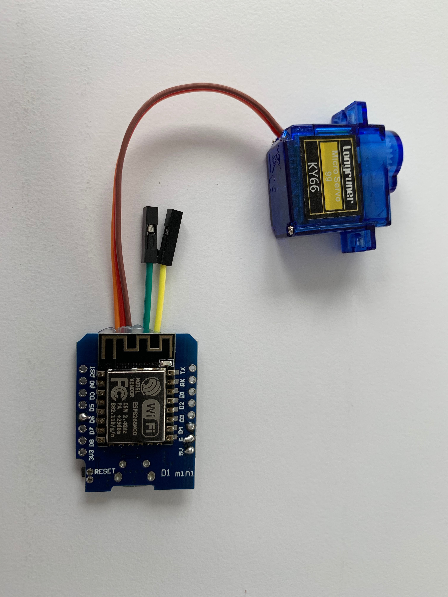
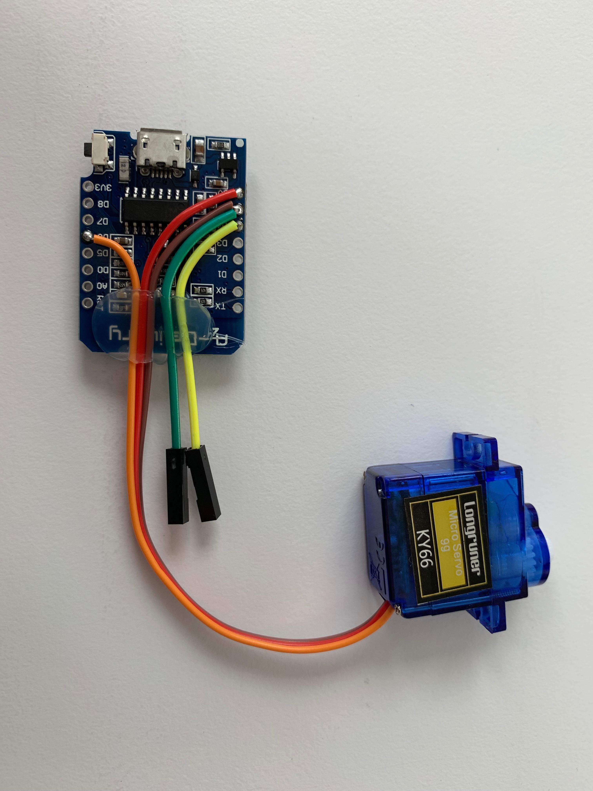
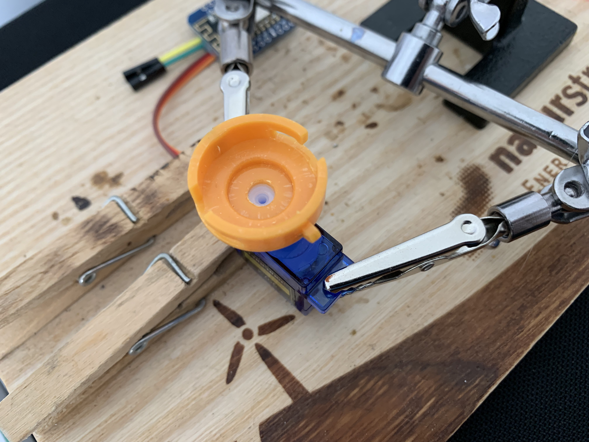
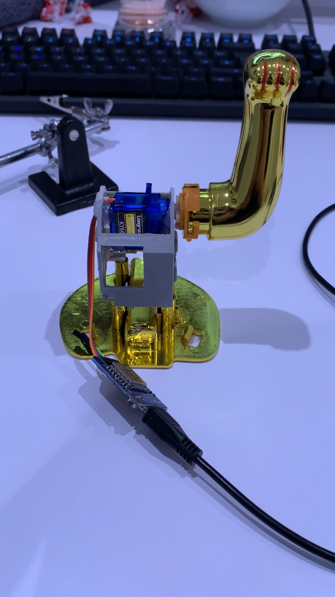
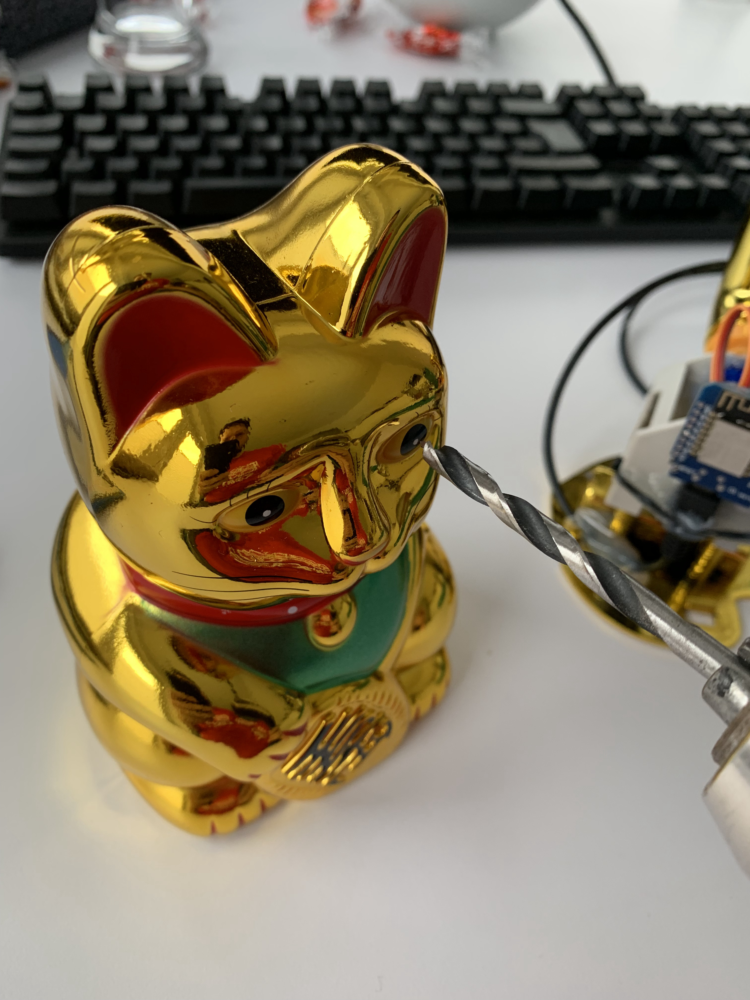
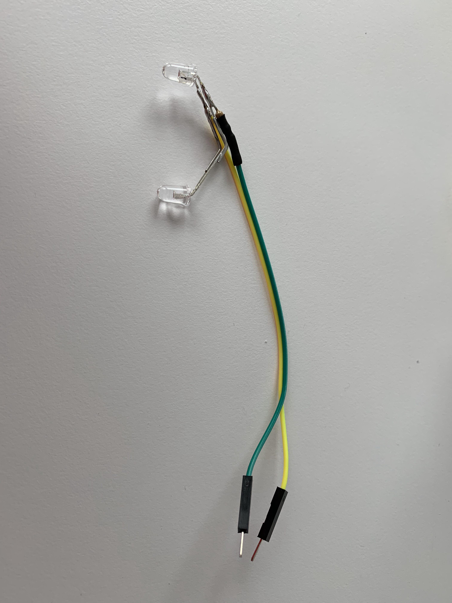

# [IQ.SH](http://www.iqsh.de)-Winkekatze 

Eine Winkekatze bildet mithilfe eines ESP8266, eines Servos, ein paar LEDs... den Mittlepunkt einer Geschichte, um ein Klassenzimmer in einen Escape-Room zu verwandeln.

## Arbeitsblätter

## Hardware

## Herstellung
| | | |
|:-------------------------:|:-------------------------:|:-------------------------:|
|  |  |  |
|  |  |  |

## Quellen und Inspiration
- https://klartext-reden.net/
- https://36c3.bleeptrack.de/
- https://de.wikipedia.org/

## Authoren
Frank Christiansen, Thorben Demand, Marco Runge und Jan-Matthis Hoffmann
