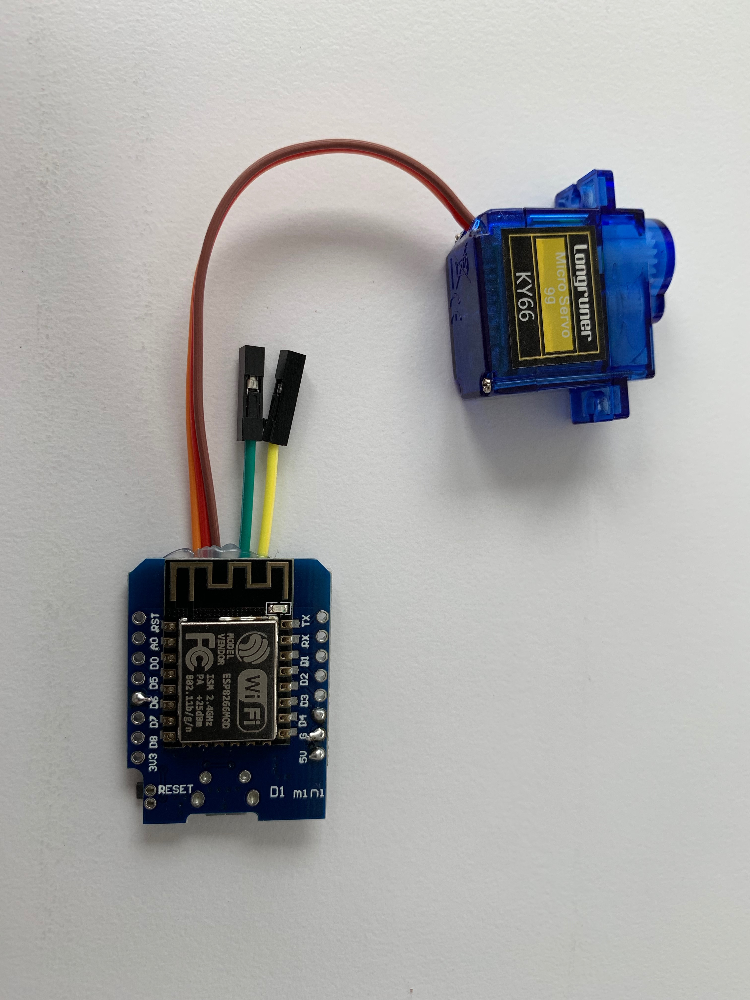
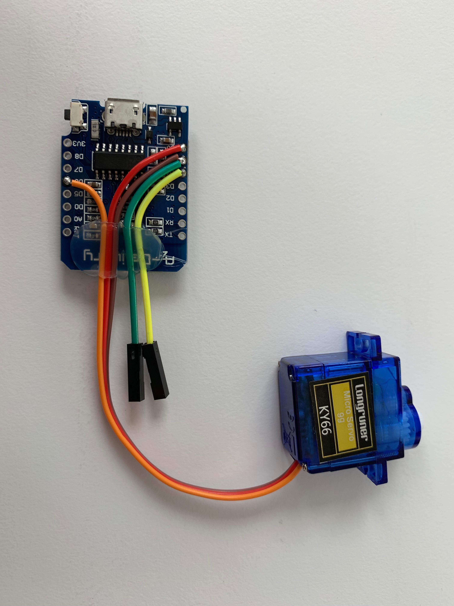
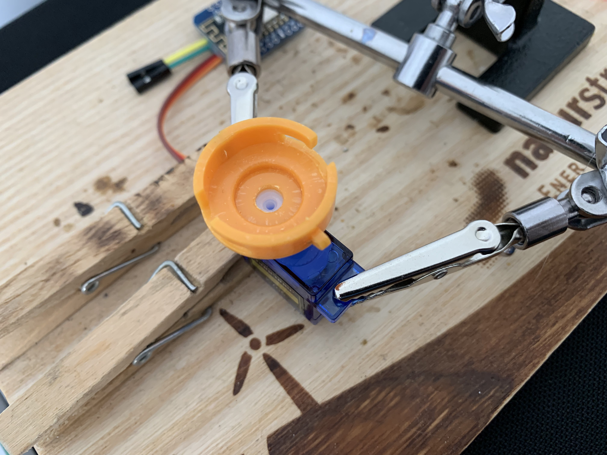
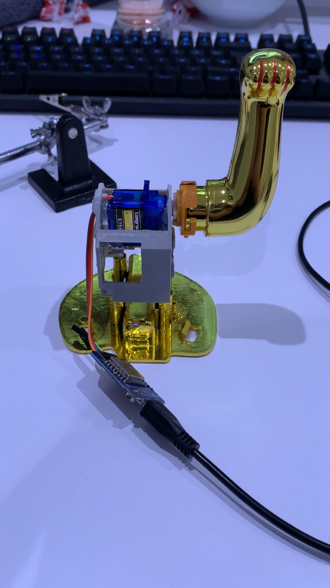
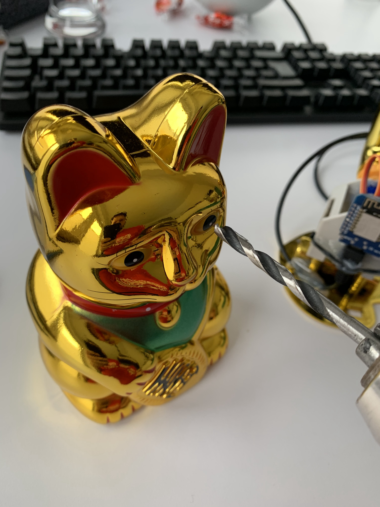
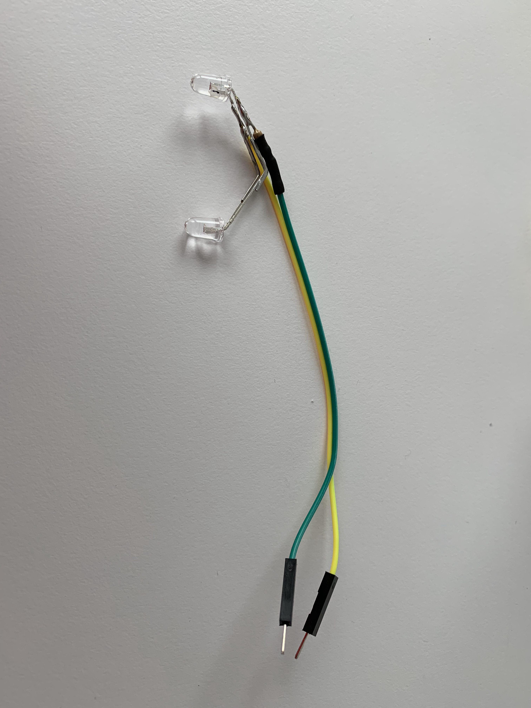

# [IQ.SH](http://www.iqsh.de)-Winkekatze

Eine Winkekatze bildet mithilfe eines ESP8266, eines Servos, ein paar LEDs... den Mittlepunkt einer Geschichte, um ein Klassenzimmer in einen Escape-Room zu verwandeln.

## Hardware

